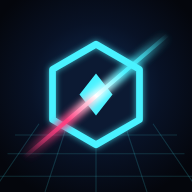
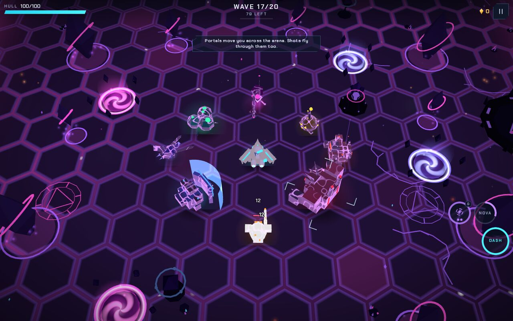
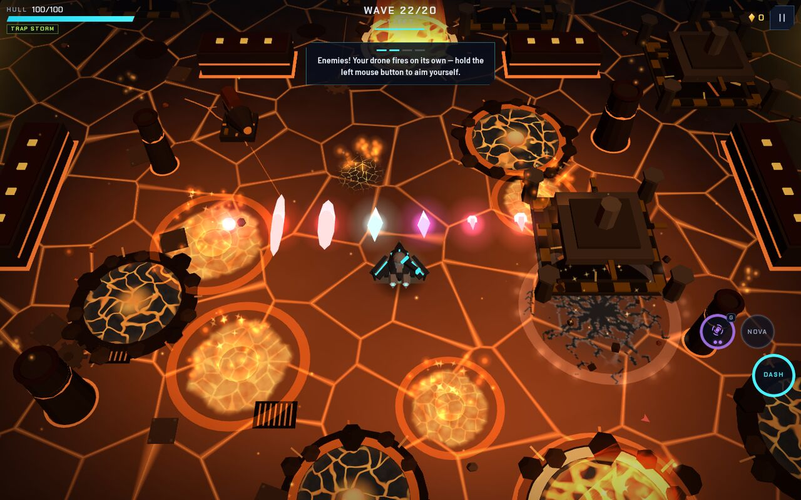
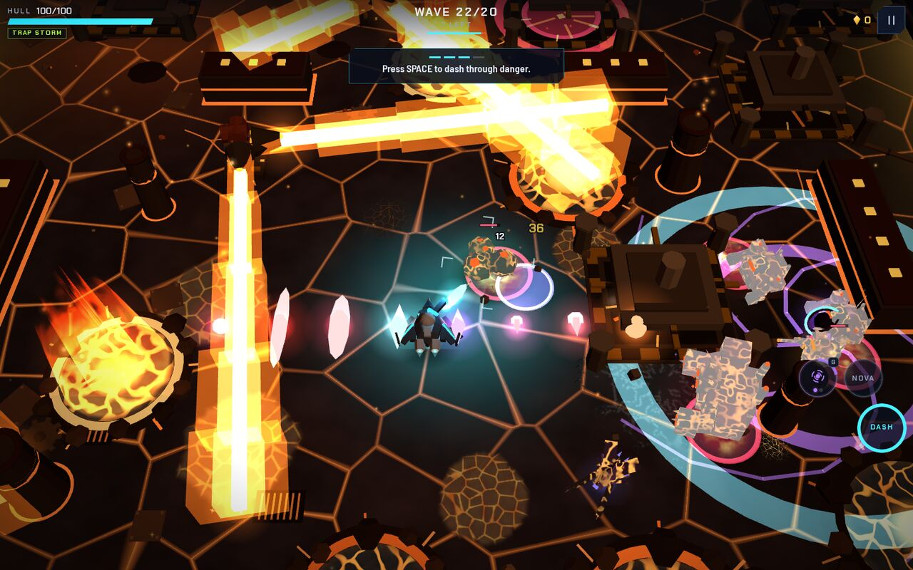
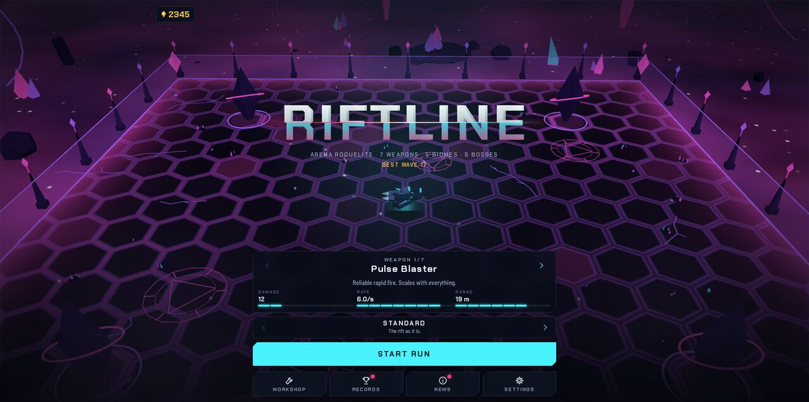

<p align="center"></p>

<h1 align="center">Riftline</h1>

<p align="center"><b>A 3D arena roguelite shooter that runs in your browser.</b><br>
Pilot a small two-legged combat robot through 20 waves of the rift, five biomes and five bosses, then keep going in Endless.</p>

<p align="center"><a href="https://aaron40776.github.io/Riftline/"><b>▶&nbsp;&nbsp;Play Riftline</b></a><br>
<sub>Desktop, and phones and tablets in landscape · installs as an offline app · free, no account</sub></p>

<p align="center">
<a href="https://github.com/Aaron40776/Riftline/actions/workflows/pages.yml"></a>
<a href="https://github.com/Aaron40776/Riftline/actions/workflows/test.yml"></a>
</p>

<p align="center"></p>

## What is Riftline?

Every run is 20 waves. After each wave you pick one of three upgrades, every fifth wave brings the boss of the biome
you are in, and after each boss the rift moves on to the next biome. Beat the Rift Core at wave 20 and the run can go
on in Endless, which keeps getting harder. Shards from every run, won or lost, buy permanent modules in the Workshop.

- **7 weapons** (Pulse Blaster, Scattergun, Arc Caster, Railgun, Rocket Pod, Disc Launcher, Ember Jet) and **60
  upgrades**: 13 evolutions and a boss card for each boss, which only that boss can give.
- **5 biomes with a boss each**: Blackout City, Ember Works, Cryo Vault, Toxin Marsh and Void Core, each with its own
  floor, hazards, traps, enemy skins, events, music and sounds.
- **25 enemy types and 5 bosses** with their own models and attacks that show and sound like what they are.
- **The Singularity**: a gadget that pulls a crowd together, then collapses.
- **A walker**: the drone has legs that swing, bend and plant, a dash is a jump, and every foot sounds like its
  ground (asphalt, grating, frozen ground, ice, mud, glass, acid).
- **Endless** with mutators, a **Workshop** of 18 modules, 47 milestones, a codex, and Threat I–V on top of Standard.
- Everything you see and hear is made in code: low-poly models, WebAudio sounds and music, no image or audio files.

| | |
|:---:|:---:|
|  |  |
| Ember Works: lava wells up where the Crucible strikes | The Singularity pulls a crowd together |
|  | |
| The menu: weapon, threat level, Workshop, Records | |

## Controls

| | Keyboard and mouse | Touch |
|---|---|---|
| Move | `W` `A` `S` `D` or arrow keys | drag on the left half |
| Aim and fire | hold the left mouse button (auto-fire shoots the nearest enemy otherwise) | drag on the right half |
| Dash | `Space` or `Shift` | `DASH` button |
| Nova | `E` (also `Q`, `F`) | `NOVA` button |
| Singularity | `G` | `GADGET` button (aimed with the aim stick) |
| Pause | `Esc` or `P` | pause button |
| Pick an upgrade | `1`–`4`, `R` rerolls | tap a card |
| Back in menus | `Esc` | back button |

Keys are read by their position, so on AZERTY and other layouts the same physical keys move the drone. *Settings →
Button layout* moves and resizes the touch buttons. Phones and tablets play in landscape only; held upright they
show a "turn your device" screen and a run waits paused.

## Running it locally

You need Node.js 22 (what CI uses) and npm.

```bash
git clone https://github.com/Aaron40776/Riftline.git
cd Riftline
npm install
npm run dev          # builds, rebuilds on change and serves http://localhost:8124
```

The browser tests drive the real game in Chromium through Playwright. Install the browser once with
`npx playwright install chromium` (the cloud environment has it already).

## Development

```bash
npm run build          # src/ -> dist/ (the deployable site)
npm run serve          # serve dist/ on http://localhost:8124
npm test               # build, deep self-test, file/PWA contract, data audit, determinism (CI runs this)
npm run check          # quick check while developing: format + the npm test steps (~2 min with cached sounds);
                       # full-QA sections can be added by name: npm run check -- run-desktop codex
npm run release-check  # everything a release needs, one step after another, with a time per step (~35-45 min)
npm run qa             # full QA: saves, settings, workshop, runs on PC and phone, layouts, buttons (~15 min)
npm run e2e            # end-to-end with real pointer and touch input on 4 device sizes
npm run audit          # world audit, data audit, a bot run to wave 22 with its post-run audit
npm run screens        # screenshots of every screen, biome and attack -> tests/shots/
node tools/qa.js scape-preview   # every biome's soundscape as WAV/MP3 -> tests/shots/scapes/ (`music`: the ten tracks)
npm run sim -- pulse,rail 31   # weapon simulation to wave 31 (| python3 tools/summarize-sim.py)
npm run format         # Prettier (width 120); CI runs npm run format:check
```

Single test scripts run with `node tools/qa.js <script> [args]`; it serves `dist/` on a free port, for example
`node tools/qa.js full-qa run-desktop` runs one section of the full QA (`QA_TIMES=1` prints the seconds per check).

The browser tests run the game in software WebGL at a few frames per second, so they never run in parallel (each
browser takes every core), and waits that depend on the game count game time (`tests/lib/wait.mjs`), not real time.
The deep test reuses its sound results while the sound engine is unchanged (`node_modules/.cache/riftline/`); CI and
`node tools/qa.js deep-test --full` render every sound again.

How the code is organised, its history and the rules for changing it: [`docs/DEVELOPMENT.md`](docs/DEVELOPMENT.md).

## Project structure

```
src/
  main.js          entry point: boot, game controller, main loop, wiring
  core/            simulation and services: world, arena, waves, AI, stats, traps, boss cards, walker, difficulty, save,
                   diagnostics (runtime log and monitor), selftest (deep self-test), util
  data/            tables: weapons, enemies, upgrades, progression, biomes, whatsnew (the News tab)
  render/          three.js renderer, models, biome visuals, traps, hazards, attacks, boss cards, 2D overlay
  audio/           sound effects, music and the sounds of the place
  ui/              DOM UI (screens, HUD, dialogs), input and the button layout editor
  index.html       page shell, all CSS, device detection, rotate screen, layout audit
  sw.js            service worker (offline cache, update handshake)
  build-info.json  version, build id, feature and change list (fetched by the game)
public/            icons, fonts, web manifest, third-party licenses (copied to dist/ unchanged)
tests/             browser tests (Playwright), shared helpers in tests/lib, fixtures with real old saves
tools/             test runner and check chains, static server, sim summary
docs/              development notes, roadmap, QA report of every release, README pictures
build.js           src/ -> dist/
CLAUDE.md          working rules for Claude Code sessions in this repository
```

## Build and deployment

Every push to `main` runs `.github/workflows/pages.yml`: it installs, runs `npm test` (which builds) and publishes
`dist/` on GitHub Pages at <https://aaron40776.github.io/Riftline/>. Pull requests and other branches run the format
check and the same tests without deploying (`.github/workflows/test.yml`).

`dist/` is a static site that works in any sub-path. The service worker caches only files of its own folder and
removes old `riftline-*` caches on update. A new version is downloaded in the background and applied when no run is
going on, so a run is never interrupted. The game file carries the version in its name, and the service worker
fetches `index.html` and `build-info.json` with `no-store`, so the 10-minute cache of GitHub Pages does no harm.

Saves live in `localStorage` under `riftline.*`. Riftdeck (<https://aaron40776.github.io/Riftdeck/>), a deckbuilder
in the same universe, runs on the same origin and only uses `riftdeck.*`, so the two games never touch each other's
data.

## Docs

- [`docs/DEVELOPMENT.md`](docs/DEVELOPMENT.md): code organisation, history, working rules, versions.
- [`docs/ROADMAP.de.md`](docs/ROADMAP.de.md): the owner's wishes, decisions and plan (older parts in German).
- [`docs/QA-REPORT.de.txt`](docs/QA-REPORT.de.txt): what changed and how it was tested, for every release (German
  until 3.7.0, English since 3.7.1).

Automated tests run in Chromium; Firefox and Safari are checked by hand.

## Licenses

Riftline's own code has no license file yet; the owner decides whether it gets one. The game bundles
three.js (MIT) and uses the fonts Chakra Petch and Barlow Semi Condensed (SIL Open Font License 1.1); their notices
and license texts are in [`public/THIRD-PARTY-NOTICES.txt`](public/THIRD-PARTY-NOTICES.txt), which is also published
next to the game.
